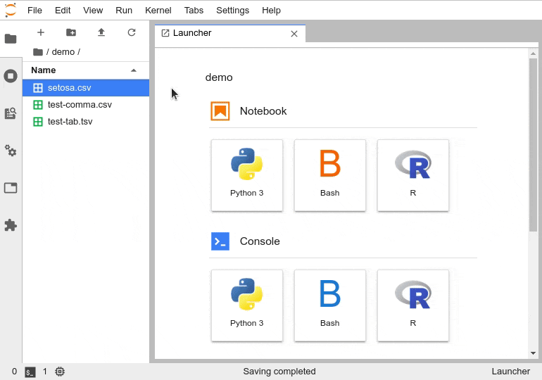
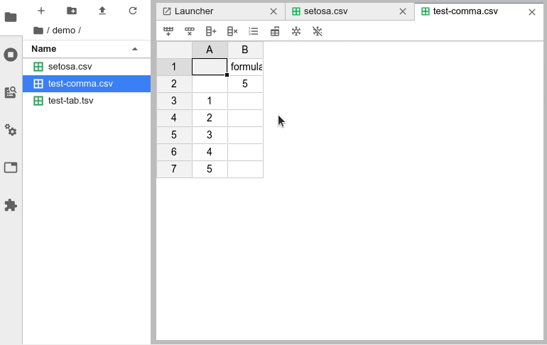
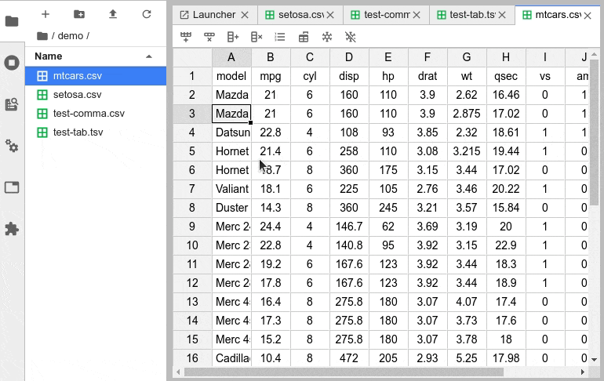

# JupyterLab Spreadsheet Editor

JupyterLab spreadsheet editor enables interactive editing of comma/tab separated value spreadsheets.
It support formulas, sorting, column/row rearrangements and more!

## Showcase

**Fully featured integration**

- row/column operations, column width adjustment
- search and replace



**Formula support**
basic formula calculation (rendering) - as implemented by jExcel.



**Column freezing**
for exploration of wide datasets with many covariates




**Launcher items**:
create CSV/TSV files easily from the launcher or the palette.


**Lightweight and reliable dependencies**:
the spreadsheet interface is built with the [jexcel](https://github.com/paulhodel/jexcel), while [Papa Parse](https://github.com/mholt/PapaParse) provides very fast, [RFC 4180](https://tools.ietf.org/html/rfc4180) compatible CSV parsing (both have no third-party dependencies).

## Requirements

* JupyterLab >= 2.0

## Install

```bash
jupyter labextension install spreadsheet-editor
```

## Contributing

### Install

The `jlpm` command is JupyterLab's pinned version of
[yarn](https://yarnpkg.com/) that is installed with JupyterLab. You may use
`yarn` or `npm` in lieu of `jlpm` below.

```bash
# Clone the repo to your local environment
# Move to spreadsheet-editor directory

# Install dependencies
jlpm
# Build Typescript source
jlpm build
# Link your development version of the extension with JupyterLab
jupyter labextension link .
# Rebuild Typescript source after making changes
jlpm build
# Rebuild JupyterLab after making any changes
jupyter lab build
```

You can watch the source directory and run JupyterLab in watch mode to watch for changes in the extension's source and automatically rebuild the extension and application.

```bash
# Watch the source directory in another terminal tab
jlpm watch
# Run jupyterlab in watch mode in one terminal tab
jupyter lab --watch
```

### Uninstall

```bash

jupyter labextension uninstall spreadsheet-editor
```

## Related extensions

Spreadsheet editors:
- [jupyterlab-tabular-data-editor](https://github.com/jupytercalpoly/jupyterlab-tabular-data-editor)

Spreadsheet viewers:

- [jupyterlab-spreadsheet](https://github.com/quigleyj97/jupyterlab-spreadsheet) implements Excel spreadsheet viewer
- the built-in [csvviewer](https://github.com/jupyterlab/jupyterlab/tree/master/packages/csvviewer) ([extension](https://github.com/jupyterlab/jupyterlab/tree/master/packages/csvviewer-extension)) allows to display CSV/TSV files

In-notebook spreadsheet widgets:
- [ipysheet](https://github.com/QuantStack/ipysheet) - programmable sheet creation, exploration and modification
- [qgrid](https://github.com/quantopian/qgrid) - interactive DataFrame exploration and modification
